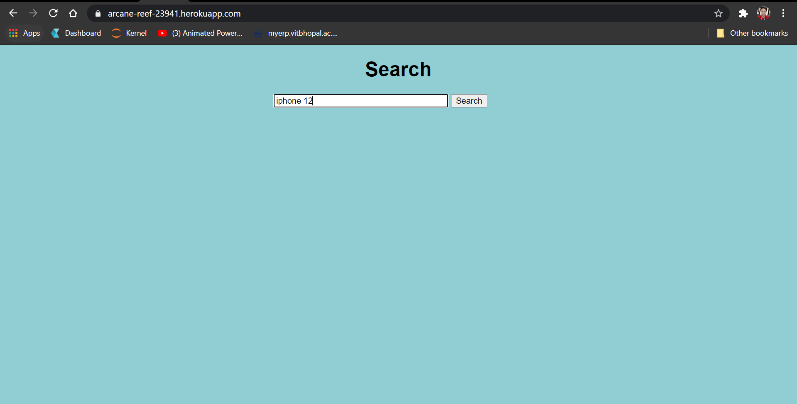

# ReviewScrapperWithDeployment

## Introduction
<p>You can find the deployed project here - https://arcane-reef-23941.herokuapp.com/. 
 Review Scrapper is coded in Python to scrap product reviews from www.flipkart.com.
I have created it as a first step to learn databases, web API and deployment.</p>

## Table of contents
* [Technologies](#technologies)
* [Installation](#installation)
* [DeploymentSteps](#deployment-steps)
* [Illustrations](#illustrations)

## Technologies
Project is created with:
* Python 3.6.9
* beautiful soup == 4.9.1, for parsing request data into html format
* Flask == 1.1.2
* pymongo == 3.11.3

For now database connection with pymongo is only made in the local web API which recides in flask_app.py
For deployment i have made a seperate file - 'app.py', which does not deals with database.

## Installation
```
$ pip install -r requirements.txt
```
## Deployment Steps

Make sure to have app.py, requirements.txt, Procfile, Static and templates folder in the project directory. Open git bash and make your project directory as working directory. Also make sure to install heroku cli in your system.

```
$ Heroku login
$ git init
$ git add .
$ git commit -m "initial commit"
$ heroku create
$ git remote -v
$ git push heroku master
```
## Illustrations
Searching for iphone 12 on Flipkart


Searching for the same product on our page


Scrapped reviews from flipkart


